# Hi, I'm Dr4ks! 👋

## 🚀 About Me
I'm a Cyber Security student.

## 🔗 Links

## 🛠 Skills
Python

# Design Patterns

Design patterns are proven solutions to recurring problems in software design. They are templates for solving similar problems in different contexts. Design patterns help in making software more modular, reusable, and maintainable.

## Practical Examples
These design patterns which we covered with examples.

- [Adapter](#adapter)
- [Bridge](#bridge)
- [Builder](#builder)
- [Chain of Responsibility](#chain-of-responsibility)
- [Command](#command)
- [Composite](#composite)
- [Decorator](#decorator)
- [Facade](#facade)
- [Factory](#factory-method)
- [Iterator](#iterator)
- [Observer](#observer)
- [Proxy](#proxy)
- [Singleton](#singleton)
- [State](#state)
- [Strategy](#strategy)
- [Template-Method](#template-methodd)

## Adapter
The Adapter design pattern is a structural design pattern that allows incompatible interfaces to work together. It is useful when an existing class/interface cannot be modified to conform to the requirements of a new interface, or when there are multiple incompatible interfaces that need to be unified.

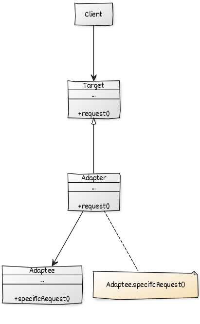

[Example](scripts/adapter.py)

## Bridge
The Bridge design pattern is used to separate an abstraction from its implementation so that both can be changed independently. This pattern is useful when there are multiple implementations of a feature, and the client should be decoupled from the implementation details.

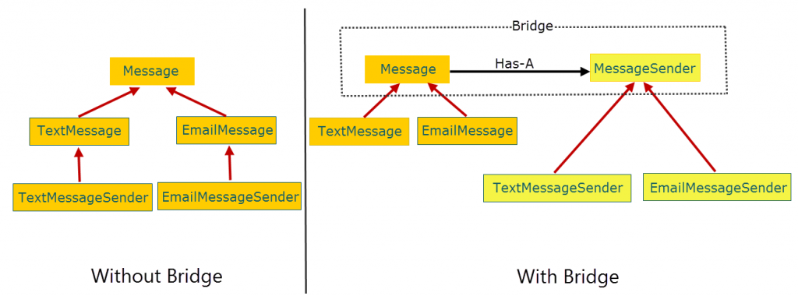

[Example](scripts/bridge.py)

## Builder
The Builder design pattern is a creational pattern that allows for the step-by-step creation of complex objects. It separates the construction of an object from its representation, enabling the same construction process to create different representations. The pattern is useful when an object requires various configurations or when the creation process is complex and involves multiple steps.

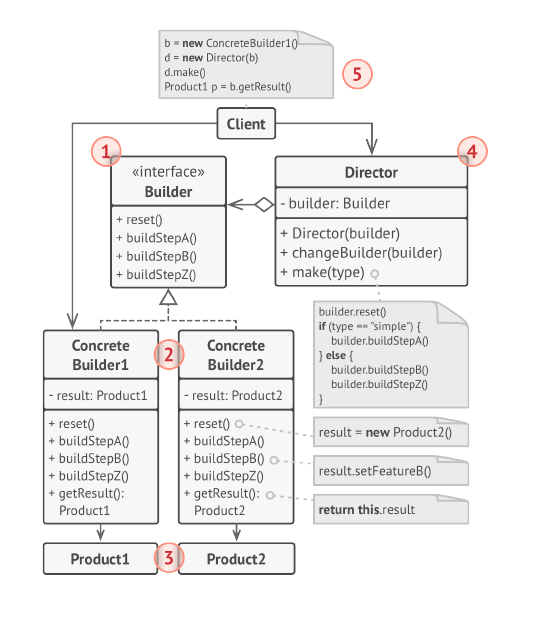

[Example](scripts/builder.py)

## Chain of Responsibility
The Chain of Responsibility design pattern is a behavioral design pattern that allows a group of objects to handle a request, with each object either handling the request or passing it on to the next object in the chain.

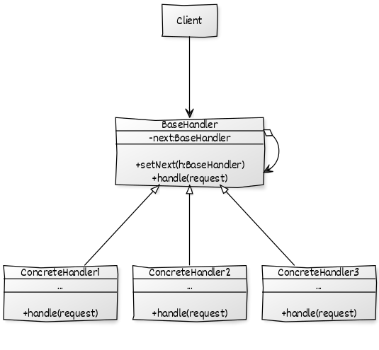

[Example](scripts/chain.py)

## Command
The Command design pattern is a behavioral pattern that turns a request into a stand-alone object that contains all information about the request. This transformation allows for parameterizing other objects with different requests, queuing requests, and logging the requests. It also provides support for undoable operations.

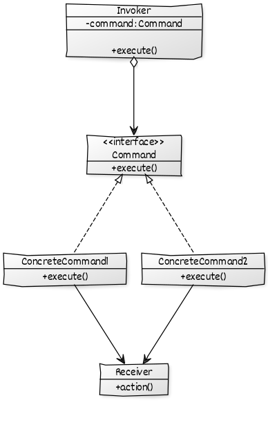

[Example](scripts/command.py)

## Composite
The Composite design pattern is a structural design pattern that lets you compose objects into a tree-like structure and work with the tree as if it was a singular object. The composite pattern allows you to create a hierarchy of objects where each object can be treated individually or as a part of a larger group.

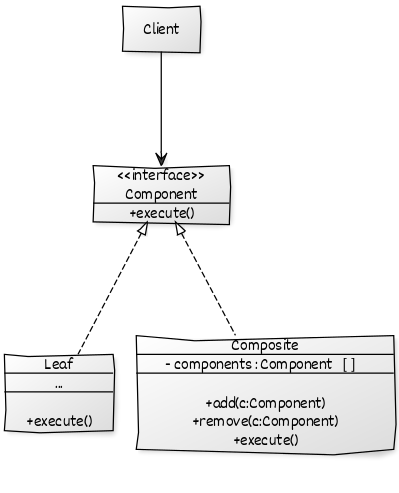

[Example](scripts/composite.py)

## Decorator
The Decorator design pattern is a structural pattern that allows behavior to be added to an individual object, either statically or dynamically, without affecting the behavior of other objects from the same class.

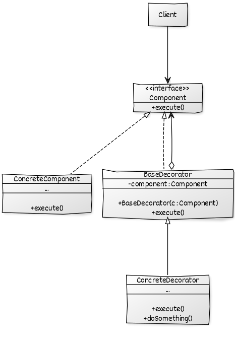

[Example](scripts/decorator.py)

## Facade
The Facade design pattern is a structural pattern that provides a simplified interface to a complex system of classes, interfaces, and objects. It is used to provide a single, unified interface to a set of interfaces in a subsystem, which makes the subsystem easier to use and understand.

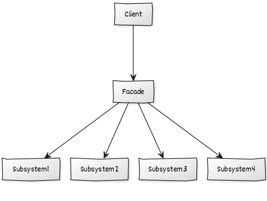

[Example](scripts/facade.py)

## Factory-Method
The Factory-Method design pattern is a creational pattern that provides an interface for creating objects in a super class, but allows subclasses to alter the type of objects that will be created. This pattern is useful when you want to create a family of related objects but you don't know exactly what kind of objects you need to create until runtime.

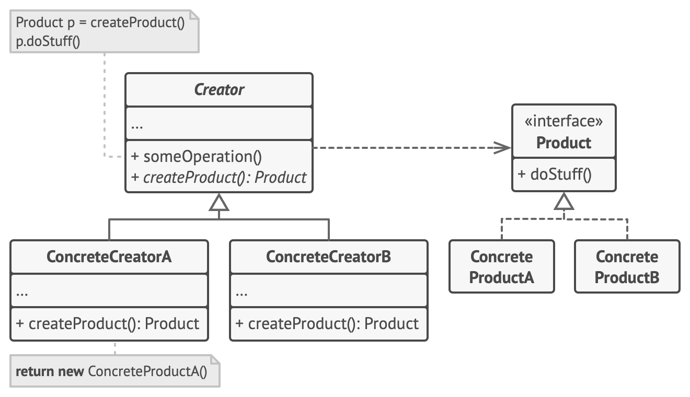

[Example](scripts/factory.py)

## Iterator
The Iterator design pattern is a behavioral pattern that provides a way to access the elements of an aggregate object (such as a list) sequentially without exposing its underlying representation. It separates the concerns of traversal and collection, allowing multiple traversals of the same collection simultaneously.

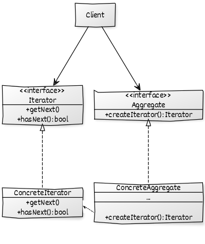

[Example](scripts/iterator.py)

## Observer
The Observer design pattern is a behavioral design pattern that allows one-to-many communication between objects in a loosely coupled manner. In this pattern, an object (called the subject) maintains a list of its dependents (called observers) and notifies them automatically of any state changes, usually by calling one of their methods.

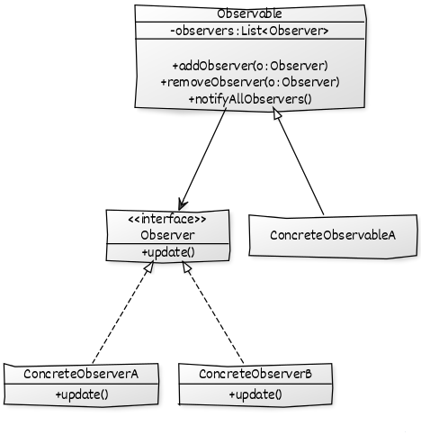

[Example](scripts/observer.py)

## Proxy
The Proxy design pattern is a structural pattern that allows us to provide a surrogate or placeholder for another object to control access to it. It provides a way to add an extra level of indirection to support distributed, controlled, or intelligent access.

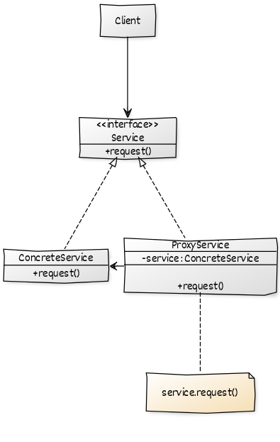

[Example](scripts/proxy.py)

## Singleton
The Singleton design pattern is a creational design pattern that restricts the instantiation of a class to one single instance and provides a global point of access to that instance. This can be useful when there should be only one instance of a class in the system, such as in the case of a configuration manager or a database connector.

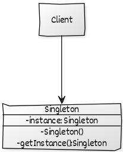

[Example](scripts/singleton.py)

## State
The State design pattern is a behavioral pattern that allows an object to change its behavior when its internal state changes. This pattern is useful when an object's behavior depends on its state and needs to perform different actions based on that state. By encapsulating each state in a separate class, the State pattern promotes cleaner code by reducing conditional complexity.

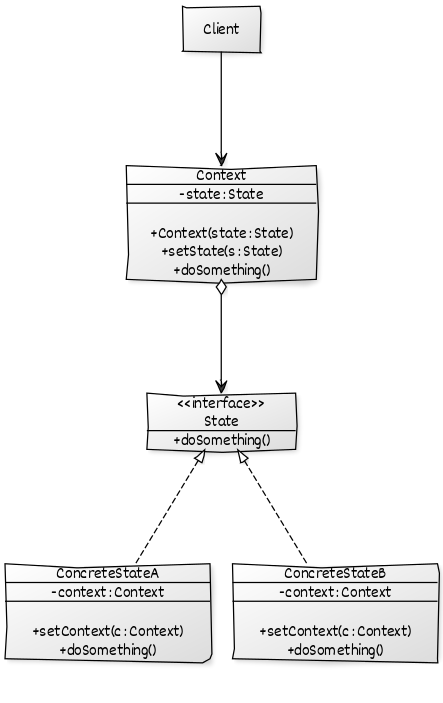

[Example](scripts/state.py)

## Strategy
The Strategy design pattern is a behavioral design pattern that allows you to define a family of algorithms, encapsulate each one, and make them interchangeable at runtime. This pattern allows the algorithms to vary independently from the clients that use them. In this way, you can use this pattern to choose the algorithm that best suits a particular problem, context or situation at runtime.

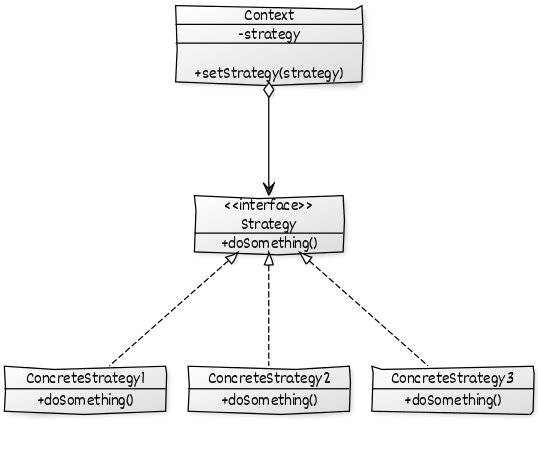

[Example](scripts/strategy.py)

## Template-Method
The Template Method design pattern is a behavioral pattern that allows you to define the skeleton of an algorithm in a superclass but lets you override specific steps of the algorithm in subclasses. This pattern is useful when you want to define a set of steps that can be customized to fit a particular use case.

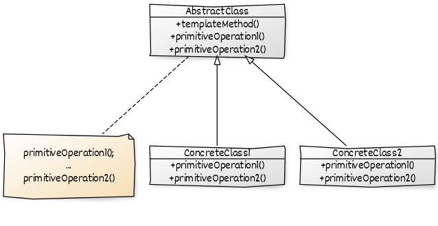

[Example](scripts/template.py)

## Authors

- [@dr4ks](https://www.github.com/Dr4ks)

